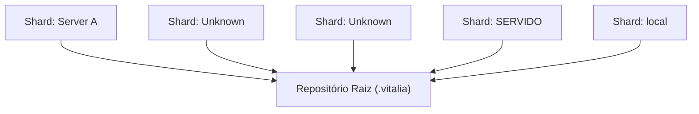

<!-- DASHBOARD.md | Atualizado em: 31-07-2026 09:35:13(GMT-04:00) -->

# Dashboard de Contexto: .vitalia

## Semáforo de Sincronização

- **Status:** LIVRE
- **Máquina:** N/A
- **Expira em:** N/A

## Shards Ativos

| Máquina | Tarefa Atual | Etapas | Status | Último Sync | Próximo Passo (P0) |
| :--- | :--- | :--- | :--- | :--- | :--- |
| **Server A** (srv-A) | Testing sync | Test step 1 | Concluído | 30-07-2026 12:00:00(GMT-04:00) | Do next thing |
| **Unknown** (test1) | Unknown | Unknown | Unknown | Unknown | Unknown |
| **Unknown** (Unknown) | Unknown | Unknown | Unknown | Unknown | Unknown |
| **SERVIDO** (01397893) | 005-dashboard-spa | Refatoração completa da arquitetura do Dashboard para uma SPA (React + Vite + TypeScript) via pipeline SDD; Preenchimento de lacunas (gaps) no Backend FastAPI; Implementação de Design System "UI UX Pro Max"; Criação e integração das telas Telemetry HUD, Node Inventory, Queue Inspector e Settings; Build do frontend para a pasta estática do backend (vitalia-core/static); Empacotamento de uma versão portátil em vitalia-release/; Instrução técnica de reset de histórico para o repositório de contexto na nova máquina. | Concluído | 31-07-2026 09:18:00(GMT-04:00) | Realizar o setup, deploy e os testes interativos da pasta vitalia-release na nova máquina. |
| **local** (local) | Validação do barramento distribuído (Redis) e resolução do erro de dependência legada do Autogen. | Unknown | Concluído | ⚠️ 28-07-2026 16:31:11 | Iniciar o desenvolvimento da SPEC 003 da arquitetura e dar início à refatoração do código legado do projeto para a nova arquitetura modular, visto que o barramento distribuído (Pub/Sub) já provou sua viabilidade. |

## Arquitetura de Contexto

