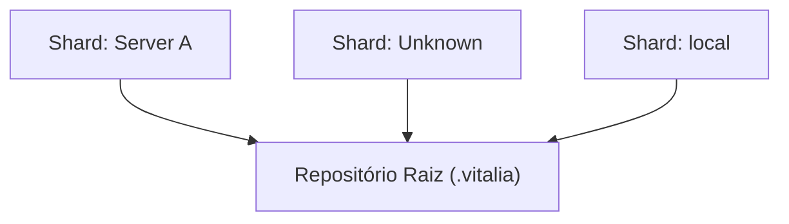

<!-- DASHBOARD.md | Atualizado em: 30-07-2026 16:27:58(GMT-04:00) -->

# Dashboard de Contexto: .vitalia

## Semáforo de Sincronização

- **Status:** LIVRE
- **Máquina:** N/A
- **Expira em:** N/A

## Shards Ativos

| Máquina | Tarefa Atual | Etapas | Status | Último Sync | Próximo Passo (P0) |
| :--- | :--- | :--- | :--- | :--- | :--- |
| **Server A** (srv-A) | Testing sync | Test step 1 | Concluído | 30-07-2026 12:00:00(GMT-04:00) | Do next thing |
| **Unknown** (test1) | Unknown | Unknown | Unknown | Unknown | Unknown |
| **local** (local) | Validação do barramento distribuído (Redis) e resolução do erro de dependência legada do Autogen. | Unknown | Concluído | ⚠️ 28-07-2026 16:31:11 | Iniciar o desenvolvimento da SPEC 003 da arquitetura e dar início à refatoração do código legado do projeto para a nova arquitetura modular, visto que o barramento distribuído (Pub/Sub) já provou sua viabilidade. |

## Arquitetura de Contexto

