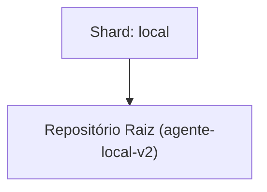

<!-- README.md | Atualizado em: 28-07-2026 16:33:08(GMT-04:00) -->

# Dashboard de Contexto: agente-local-v2

## Shards Ativos

| Máquina | Tarefa Atual | Etapas | Status | Último Sync | Próximo Passo (P0) |
| :--- | :--- | :--- | :--- | :--- | :--- |
| **local** (local) | Validação do barramento distribuído (Redis) e resolução do erro de dependência legada do Autogen. | Unknown | Concluído | 28-07-2026 16:31:11 | Iniciar o desenvolvimento da SPEC 003 da arquitetura e dar início à refatoração do código legado do projeto para a nova arquitetura modular, visto que o barramento distribuído (Pub/Sub) já provou sua viabilidade. |

## Arquitetura de Contexto

