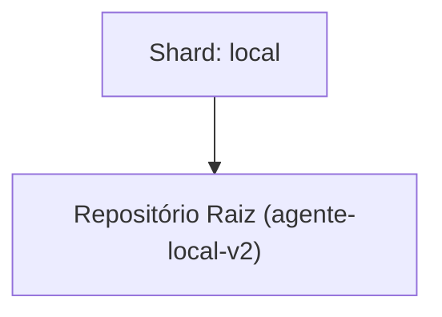

<!-- README.md | Atualizado em: 30-07-2026 15:29:26(GMT-04:00) -->

# Dashboard de Contexto: agente-local-v2

## Shards Ativos

| Máquina | Tarefa Atual | Etapas | Status | Último Sync | Próximo Passo (P0) |
| :--- | :--- | :--- | :--- | :--- | :--- |
| **local** (local) | SPEC-004 Tasks and IMPL_GUARD_RAILS creation | Unknown | Concluído | 30-07-2026 15:27:00 | - Iniciar a execução do `/vitalia-spec-implement` da SPEC-004 (Context Refactor) com o Gemini 3.1 Pro, seguindo as guidelines do `IMPL_GUARD_RAILS.md`. |

## Arquitetura de Contexto

