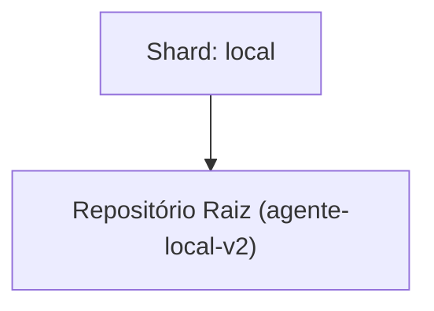

<!-- README.md | Atualizado em: 28-07-2026 11:28:38(GMT-04:00) -->

# Dashboard de Contexto: agente-local-v2

## Shards Ativos

| Máquina | Tarefa Atual | Etapas | Status | Último Sync | Próximo Passo (P0) |
| :--- | :--- | :--- | :--- | :--- | :--- |
| **local** (local) | Aprovadas especificações formais Spec 002 (Redis Concurrency Lock) e Spec 003 (Vitalia Dashboard & Node Manager) | Unknown | Concluído (Fase de Especificação) | 28-07-2026 11:26:20 | Iniciar planejamento de arquitetura de código (`/vitalia-spec-plan`) e geração de tarefas (`/vitalia-spec-tasks`) para as duas especificações aprovadas (Spec 002 e Spec 003). |

## Arquitetura de Contexto

