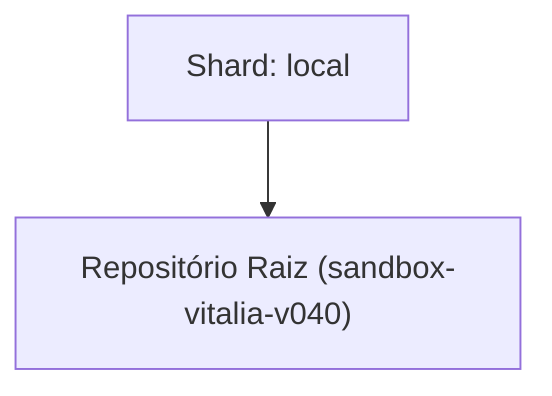

<!-- README.md | Atualizado em: 24-07-2026 13:54:24(GMT-04:00) -->

# Dashboard de Contexto: sandbox-vitalia-v040

## Shards Ativos

| Máquina | Tarefa Atual | Etapas | Status | Último Sync | Próximo Passo (P0) |
| :--- | :--- | :--- | :--- | :--- | :--- |
| **local** (local) | Teste e validação dos fluxos de sessão | Unknown | Concluído | 24-07-2026 13:53:05 | Definir o escopo da primeira feature via `/vitalia-spec-specify` |

## Arquitetura de Contexto

