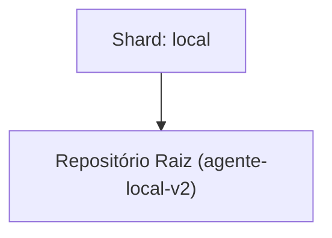

<!-- README.md | Atualizado em: 29-07-2026 10:09:21(GMT-04:00) -->

# Dashboard de Contexto: agente-local-v2

## Shards Ativos

| Máquina | Tarefa Atual | Etapas | Status | Último Sync | Próximo Passo (P0) |
| :--- | :--- | :--- | :--- | :--- | :--- |
| **local** (local) | Refatoração Estrutural e Correção do Uvicorn / Pytest (Fases 8 e 9 SDD). | Unknown | Concluído | 29-07-2026 10:07:54 | Iniciar o desenvolvimento das features do Dashboard Web (Visão Geral de Nós e Sistema) conforme as Histórias de Usuário pendentes na Especificação. |

## Arquitetura de Contexto

