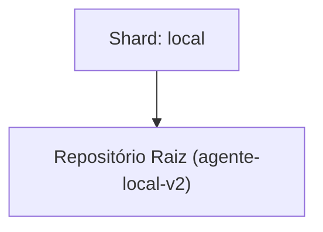

<!-- README.md | Atualizado em: 27-07-2026 20:41:22(GMT-04:00) -->

# Dashboard de Contexto: agente-local-v2

## Shards Ativos

| Máquina | Tarefa Atual | Etapas | Status | Último Sync | Próximo Passo (P0) |
| :--- | :--- | :--- | :--- | :--- | :--- |
| **local** (local) | Debugging e Especificação do Kill Switch e Symlinks globais | Unknown | Concluído | 2026-07-27 20:41:00 | - Reinstalar o kit globalmente (`install.sh`) e validar o comportamento do Kill Switch no projeto local (agente-local-v2). |

## Arquitetura de Contexto

