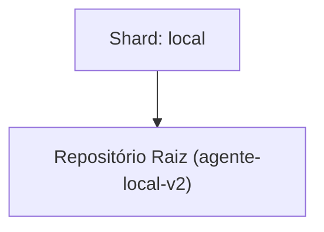

<!-- README.md | Atualizado em: 28-07-2026 15:03:52(GMT-04:00) -->

# Dashboard de Contexto: agente-local-v2

## Shards Ativos

| Máquina | Tarefa Atual | Etapas | Status | Último Sync | Próximo Passo (P0) |
| :--- | :--- | :--- | :--- | :--- | :--- |
| **local** (local) | Encerramento Spec 002 (Integração assíncrona, observability e demo pipeline) | Unknown | Concluído | 28-07-2026 15:01:40 | Iniciar os preparativos para o setup Multimáquinas (Nó 1 x Nó 2 físico) usando a engine de lock recém construída, ou partir para a implementação da próxima SPEC (`003`) da arquitetura. |

## Arquitetura de Contexto

